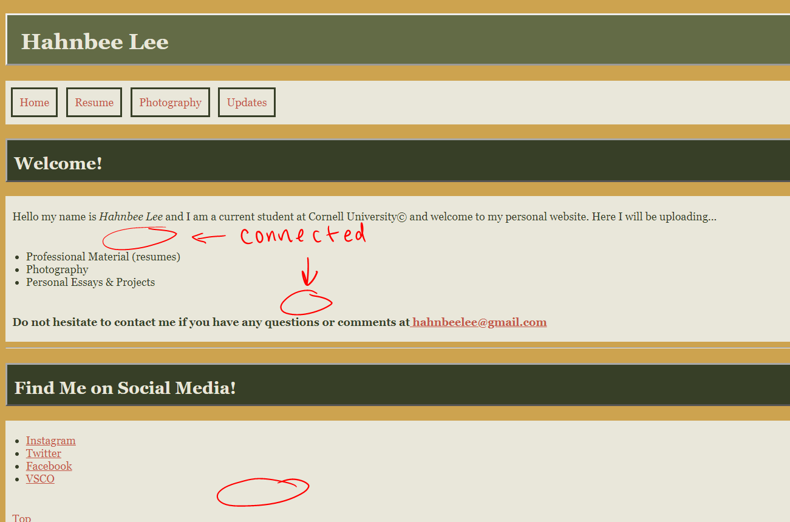
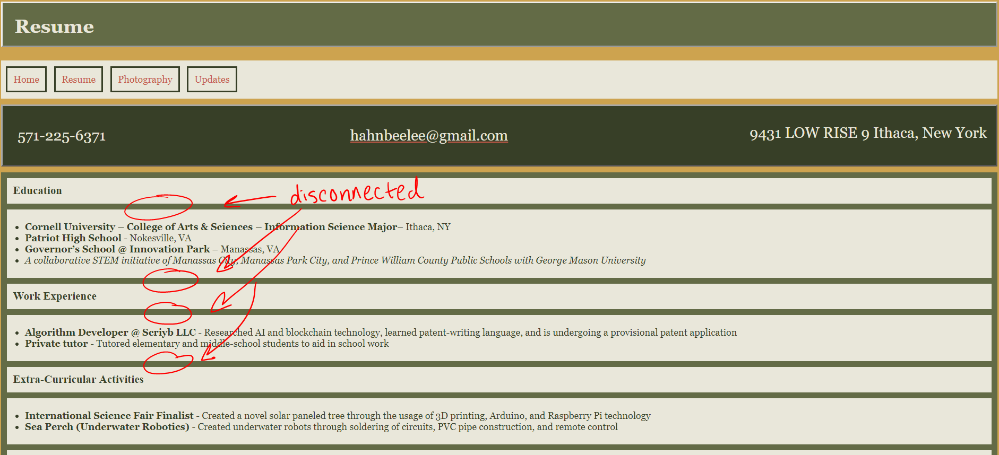
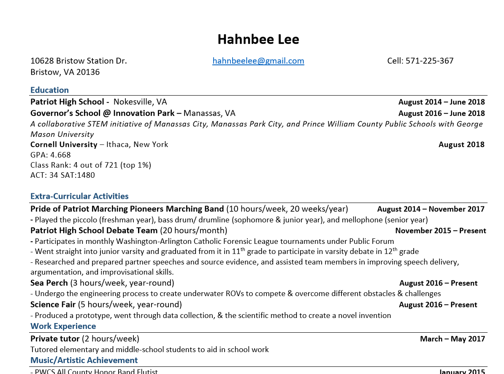
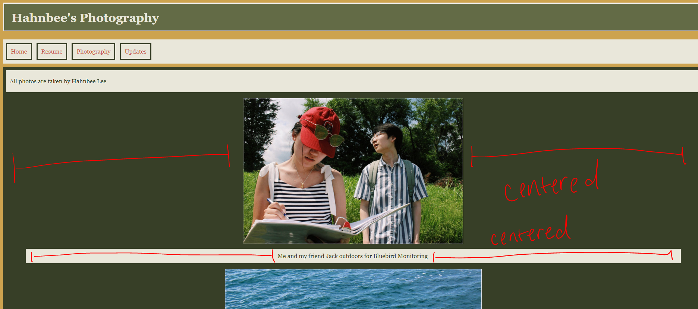

# Project 1 - Design Journey

**For each milestone, complete only the sections that are labeled with that milestone.**

## Markdown Instructions

This is a Markdown file. All written documents that you will submit this semester will be Markdown files. Markdown is a commonly used format by developers and bloggers. It's something that you should know.

The following links are Markdown references:
- <https://guides.github.com/features/mastering-markdown/>
- <https://github.com/adam-p/markdown-here/wiki/Markdown-Cheatsheet>

When writing your Markdown file in Atom. Open the command palette and search for **Markdown Preview: Toggle**. This will open up a panel in Atom where you can preview your formatted Markdown file.

This is how your insert images into your Markdown documents:

## Milestone 1

Make the case for your decisions using concepts from class, as well as other design principles, theories, examples, and cases from outside of class. You can use bullet points and lists, or full paragraphs, or a combo, whichever is appropriate. The writing should be solid draft quality but doesn't have to be fancy.

### Target Audience (Milestone 1)

[Briefly explain who the intended target audience(s) is(are) for your website.]
- The target audience of my website is anybody who wants to get to know me - whether it's friends and family or a more professional setting I want this website to entail all parts of my life. Although this website is both for casual and professional usage the general mood of the site will be more on the professional end.

### Feel and Features (Milestone 1)

[Briefly describe the feel and features your site will have to cater to those audiences.]
- The site will be aesthetically pleasing but not distracting. It will be full of pastel and muted colors that are soothing and not distracting.
- Everything will be easily accessible and user friendly.

### Final Content (Milestone 1)

[Briefly describe the content you plan to include in the final submission, and why it's the right content for those audiences.]
- In the final content I am going to have multiple tabs.
  * The first tab is going to be a professional resume
  * The second tab is going to be essays, projects, and any relevant/professional updates on my life that I believe others should know about. It will sort of be in the format of a blog, but it will be included in the one tab and the whole site will not be dedicated to updates.
  * The third tab will be photographs that I took and photos of me that I believe are good and/or helpful for anyone who wants to catch up on my life.

## Milestone 2

Make the case for your decisions using concepts from class, as well as other design principles, theories, examples, and cases from outside of class.

Each section is probably around 1 reasonably sized paragraph (3-5 sentences).

### Target Audience (Milestone 2)

[A clearer description of audience: who are they, what are they interested in with respect to this site, and what are the design goals for that audience.]

This website is catered to people who want to know who I am as a person. I would like to include this website on my resume when I am applying for jobs. One may think that the Photography and Updates tabs are a little bit too personal; however, I believe that when I am applying for jobs this will only build my personality up more. Additionally, I also have the Resume tab for professional reasons and once I have more professional material I hope to include that too.

### Site Theme (Milestone 2)

[A description of your overall site theme and why it's appropriate for the audience.]

My overall site theme is simply information about me. An employer who would like to know as much about me as possible can go on this website to see who I am as an individual and as a professional portfolio.

### Navigation (Milestone 2)

[A description of how you generated and considered alternatives for the site's navigation.]

The Navigation is designed in order of most to least important. First off, the Home/Introduction can be found. Although, an unique aspect of my site is its personal components the most important part is the resume which is the reason why it's second on my list. Then professionally I like to portray my photos. Lastly, the most casual of all are updates in a blog-like form that displays my most recent works at school.

### Organization (Milestone 2)

[An explanation of how you came to the organization and content that you chose.]

My home page summarizes the contents of my site and at the bottom my contact information and social media is available in the special case that anybody has questions or want to know more.

The resume section was formatted how my actual resume is formatted. The important stuff are in bold and the descriptions are normal and each section is separated by a header title.

The photography tab is just multiple photos with captions.

The updates section is inspired off of a blog-style format. So, I have the title of the assignment and the body of text.

## Milestone 3

Make the case for your decisions using concepts from class, as well as other design principles, theories, examples, and cases from outside of class.

Remember to focus on the things we can't see just by looking at the site: changes, alternatives considered, processes, and justifications.

Each section is probably around 1 reasonably sized paragraph (3-5 sentences).

### Changes from Milestone 2 (Milestone 3)

[What changes did you make from Milestone 2 to content/information/navigation, and why?]

I placed the navigation bar below header 1 because I felt like it made everything look more clean and made more sense that way.
Additionally, I added an <article> element to the posts.html page in hopes that the individual paragraphs will show up as one large element, but unfortunately it did not.

### Visual Design (Milestone 3)

[Discuss your visual designs: how did you come to them, what are their strengths and weaknesses, how do they fit your overall design goals and audiences?]
v1 is simple a slick. It doesn't deviate from the content and is not distracting. The sky blue was used to create partition, but still be light. The red accented boarders are there to add a small pop of color.

v2 is more calm and warm. I decided to use this color scheme because it isn't extreme, but it utilizes the color yellow and yellow is my favorite color. It isn't disctracting and its a screen that can be looked at for long amounts of time without getting eyestrain.

### Emotion (Milestone 3)

[Emotion is a big part of design. What emotions where you thinking about or trying to convey in your designs?]
 The first design was trying to convey professionalism without being distracting. It also utilized pastel colors to give off a sense of friendliness/welcoming.

v2 is also welcoming but with more fall colors. It is cozy and I hope the reader feels comfortable with the color scheme and content of the site.

## Final Submission - Rationale

This rationale should be polished writing: one you might submit as a report to a client or boss to help explain the project and convince them you did a good job. You'll be surprised how much writing and communicating you need to do about projects and choices on internships and jobs; practice that here.

It should be a comprehensive, complete story of the project. You might find that each section run several paragraphs (1-3). Sketches can often help tell the story of your design. Screenshots are also useful for describing issues discovered during user testing and how you addressed them. Quotes from your users during testing are also very powerful when explaining your rationale.

Your rationale should be a polished version of the earlier rationales.

### Changes from Milestone 3 (Final Submission)

- Changes since Milestone 3 and why, particularly ones you learned from testing.

From Milestone 3, I edited the navigation bar and reformatted the bodies that contained the main elements of my website to be more concise.
From testing, I learned that my previous navigation bar wasn't aesthetically pleasing. My testee did not like the way it looked; therefore, I
applied what I learned from lab 4 to reformat my navigation bar. I reformatted the bodies of my pages because previously my skills did
not allow me to fully format them the way I wanted them to look. For my index.html I connected the body elements and for my resume.html I separated
the titles from the paragraphs to make it look more aesthetically pleasing and suite my vision that I was envisioning prior to creating the site.

### Audience (Final Submission)

[A complete and polished description of the intended audience(s) for your website.]

This website is a personal website for my prospective employers. One may think that it is a little too personal for a professional website;
however, I included the photography.html page to leave a visual impact on my audience. I hope that exposing my personal life in addition to
my professional (resume.html) will leave a more lasting impact on an employer's mind. This mindset also follows for why I added
a "Life Updates" section: in hopes that an employer will read something that sticks with them for the rest of the day and will remember me.
I hope that this website will fully portray who I am as a person, so that somebody who browses through it will get to know who I am as a person fairly well.

### Design Goals (Final Submission)

[An explanation of the design goals for that audience, based on your earlier rationales.]

The design goals for an employer is to get them to know me as much as possible.
I want them to feel welcomed so I used warm, soothing colors. I also wanted the site to be very readable and comprehensive. I did not use bright colors or harsh designs in the site in hopes that the employer will focus on the content. The welcoming colors contrast from other professional sites that may use more solid whites, blacks, and blues. This color scheme was used purposefully to convey a sense of uniqueness and realness.

### Navigation (Final Submission)

[An explanation of how the final navigation met your goals and why its appropriate for your audience(s).]

The final navigation met my goals because it looks far more similar to how conventional navigation bars look like in comparison to how it looked in milestone 3. My testee suggested to redesign it the way it is now and
it looks far more aesthetically pleasing and is easier to navigate than before. Additionally, it is organized in order of importance. The further left an element is in the navigation bar, the more I want the user to visit that link. In addition to the navigation bar I was able to implement a button at the bottom of each page that redirects the user to the top of the page so that they will have easy access to the navigation bar when they reach the end of the page.
### Organization (Final Submission)

[An explanation of how the final organization met your goals and why its appropriate for your audience(s).]

The final organization met my goals because I was able to implement all organization techniques I envisioned my site would encompass. The navigation bar looks like what a typical navigation bar would look like on a website. The elements of index.html body is presented in a connected background. The resume.html page is sectioned off into different parts of the resume in a way that resembles my actual resume.

I was also about to center the photos and captions of my photography page and connect all the paragraphs. And as for the posts.html page I was also able to connect the paragraphs as I did in index.html.
The final organization is also appropriate for my audience because it is not too exuberant, but it also does not lack character. It is user friendly and everything present has a direct use - there is nothing that has no direct implementation to the functionality of the website. Thus my website is appropriate for my employer audience.

### Visual Design (Final Submission)

[An explanation of how the final design met your goals and why its appropriate for your audience(s).]

The final design met my goals because it is easy to comprehend and is simple, while simultaneously portraying my character in the most accurate way possible. The simplicity and portrayal of my individuality was present since I implemented CSS through the warm color scheme. However, I ultimately met my final design goals by making the website more user friendly and comprehensive as a whole by adding flex-boxes and using the box model to reformat my website's content.
