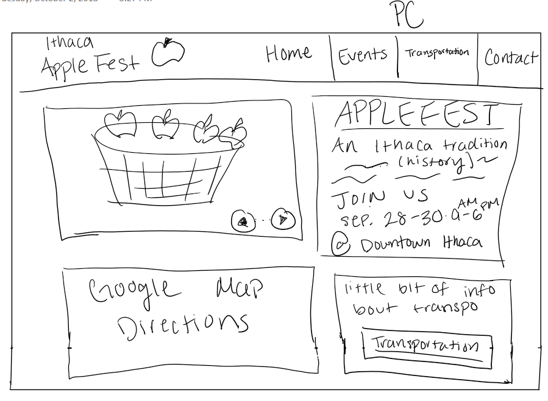

# Project 2 - Design Journey

**For each milestone, complete only the sections that are labeled with that milestone.**

Be clear and concise in your writing. Bullets points are acceptable.

## Milestone 1

### Target Audience (Milestone 1)
[In this part, write down who your target audience is.]

My target audience is families from out of town who came to Ithaca specifically for Apple Fest. They are not familiar with Ithaca and they want to know what they will get out of their semi-long journey into Ithaca.

### Persona (Milestone 1)
[In this part, create a persona that can represent your target audience, and describe him or her in details below.]

Mary, a 40 year old mom, has 2 kids that are 6 and 4 years old. Her children love food, fairs, live music and events in general. Downtown Ithaca is a 40 minute drive from where she lives.

### Needs (Milestone 1)
[Collect your target audience's needs and wants for the website and list them one by one. Come up with several appropriate design ideas on how those needs may be met. In the **Memo** field, justify your ideas and add any additional comments you have. There is no specific number of needs required for this, but you need enough to do the job. See the example design journey for an example of how you might do this.]

Format:
- Need/Want #1
  - **Needs and Wants** (What does your client and audience need and want?)
    - Wants to know if the events will be satisfactory for her kids
  - **Design Ideas and Choices** (How will you meet those needs and wants?)
    - have a tab that lists all the stations that will be opened during Apple Festival
  - **Memo** (Justify your decisions; additional notes.)
    - Question: Am I allowed to have multiple sections within a page? For example: a section for all the food stations that will be at apple fest and then a separate section for all of the performances within the events page?
- Need/Want #2
  - **Needs and Wants** (What does your client and audience need and want?)
    - Wants to know details about her transportation.
  - **Design Ideas and Choices** (How will you meet those needs and wants?)
    - Insert a google maps extension onto the site that allows you to put your current location so you will know the best route to get to Apple Festival
    - Below that there will be information about parking
    - Additional information about other forms of transportation will be included to accomadate a larger audience
  - **Memo** (Justify your decisions; additional notes.)
    - Question: When we're doing these exercises are we allowed to consider a broad audience yet like I did in the bullet point above?

### Sketches / Screenshots / Storyboards (Milestone 1)
[In this part, include the sketches for each of your pages (both desktop and mobile versions). These sketches **must** be done on paper.]

### Additional Design Justifications (Milestone 1)
[If you feel like you haven’t fully explained your design choices, or you want to explain some functions in your site (e.g., if you feel like you make a special design choice which might not meet P2M1 requirement), you can use the additional design justifications to justify your design choices. Remember, this is place for you to justify your design choices which you haven’t covered in Milestone 1. Use it wisely. However, you don’t need to fill out this section if you think all design choices have been well explained in the design journey for Milestone 1.]

---

## Milestone 2

### Task Planning (Milestone 2)
[Plan out your four tasks for Milestone 2 here before doing your user testing]

1. Will the food truck Macarollin be at Apple Fest?

2. What time does Burns and Kristy Band perform?

3. If you are attending Apple Fest do you think it's okay to bring a car as your main form of transportation?

4. You are a middle-aged mom from outside the city of Ithaca. You have 2 young kids that want to go, do you think your kids will have fun if you take them?

### User 1 (Milestone 2)
[In this part, describe your user 1 by answering the questions below.]

1. Who is your user 1, e.g., where user 1 comes from, what is your user 1’s job, characteristics, etc.?
User 1 is a student

2. Does your user 1 belong to your target audience of the site? (Yes / No)
No,
[If “No”, what’s your strategy of associating the user test results to your target audience’s needs and wants? How can your re-design choices based on the user tests make a better fit for the target audience?] I catered the tasks so that the user thinks in the mindset of my target audience.

### Tasks for User 1 (Milestone 2)
[Report the results for your user's performance on each of your four tasks. You should **describe the task** you ask the user to complete, explain **what the user did**, describe the user's **reaction/feedback** to the design, **reflect on the user's performance**, determine what **re-design choices** you will make. You can also add any additional comments in the **memo** field. See the example design journey for an example of what this would look like.]

Format:
- Task #1
  - **Task Description** (What was the task for this user?)
    -Will the food truck Macarollin be at Apple Fest?
  - **How did the user do? Did that meet your expectation?**
    - Yes, he did very well. He immediately clicked on the Events tab
  - **User’s reaction / feedback to the design** (e.g., specific problems or issues found in the tasks)
    - He was curious as to if he was already at home or not. So, he clicked home. He scrolled a lot through Events.
  - **Your reflections about the user’s performance to the task**
    - Fairly well, I should order the content in events in order of importance to my target audience.
  - **Re-design choices**
    - I will re-order my elements of events
  - **Memo** (Justify your decisions; additional notes.)
    - [You should fill this out]
- Task #2
   - **Task Description** (What was the task for this user?)
    - What time does Burns and Kristy Band perform?
  - **How did the user do? Did that meet your expectation?**
    - Immediately checked the nav bar
    - Went back to events after he realized there weren’t more nav selections
    - Found quite quickly
  - **User’s reaction / feedback to the design** (e.g., specific problems or issues found in the tasks)
    - No reaction or feedback
  - **Your reflections about the user’s performance to the task**
    - Fairly good.
    - Task was not as important because it isn’t something the target audience will really ask.
  - **Re-design choices**
    - None
  - **Memo** (Justify your decisions; additional notes.)
    - [You should fill this out]
- Task #3
   - **Task Description** (What was the task for this user?)
    - If you are attending Apple Fest do you think it's okay to bring a car as your main form of transportation?
  - **How did the user do? Did that meet your expectation?**
    - “yeah its ok you gotta pay 5 dollars”
    - Immediately went to Transportation tab
  - **User’s reaction / feedback to the design** (e.g., specific problems or issues found in the tasks)
    - Maybe the transportation info on the home screen isn’t as important if people are only going to go to the transportation tab
  - **Your reflections about the user’s performance to the task**
    - Didn’t really realize the transportation info on the front
  - **Re-design choices**
    - Put the info on the front in the Transportation tab
  - **Memo** (Justify your decisions; additional notes.)
    - [You should fill this out]
- Task #4
   - **Task Description** (What was the task for this user?)
    - You are a middle-aged mom from outside the city of Ithaca. You have 2 young kids that want to go, do you think your kids will have fun if you take them?
  - **How did the user do? Did that meet your expectation?**
    - “probably no”
    - me: why?
    - “Events = buying things and artists are not popular”
    - However, Theres food kids will like.
    - The user did great. He met my expectations.
  - **User’s reaction / feedback to the design** (e.g., specific problems or issues found in the tasks)
    - Had to scroll a lot because of the large pictures.
  - **Your reflections about the user’s performance to the task**
    - A lot went through their head and I appreciated the depth of thought. I think the website provided information for them to get to a good conclusion.
  - **Re-design choices**
    - Make photos smaller
  - **Memo** (Justify your decisions; additional notes.)
    - [You should fill this out]

### User 2 (Milestone 2)
[In this part, describe your user 2 by answering the questions below.]

1. Who is your user 2, e.g., where user 2 comes from, what is your user 2’s job, characteristics, etc.? He is a Cornell student that is a CS major and works in the dining halls.

2. Does your user 2 belong to your target audience of the site? (Yes / No) No

[If “No”, what’s your strategy of associating the user test results to your target audience’s needs and wants? How can your re-design choices based on the user tests make a better fit for the target audience?] I catered the tasks so that the user thinks in the mindset of my target audience.

### Tasks for User 2 (Milestone 2)
[Report the results for your user's performance on each of your four tasks. You should **describe the task** you ask the user to complete, explain **what the user did**, describe the user's **reaction/feedback** to the design, **reflect on the user's performance**, determine what **re-design choices** you will make. You can also add any additional comments in the **memo** field. See the example design journey for an example of what this would look like.]

Format:
- Task #1
  - **Task Description** (What was the task for this user?)
    -Will the food truck Macarollin be at Apple Fest?
  - **How did the user do? Did that meet your expectation?**
    - The user went far beyond my expectations. He was lazy and found the easy way out.
    - [Maybe with multiple points]
  - **User’s reaction / feedback to the design** (e.g., specific problems or issues found in the tasks)
    - The user used Ctrl+F “Food” to find the answer.
  - **Your reflections about the user’s performance to the task**
    - He was too lazy to go through the actual site, so he took the easy way out. I do believe some of our audience would actually do that.
  - **Re-design choices**
    - Make the words in pictures actual words that you can use ctrl+F to go through
  - **Memo** (Justify your decisions; additional notes.)
    - [You should fill this out]
- Task #2
   - **Task Description** (What was the task for this user?)
    - What time does Burns and Kristy Band perform?
  - **How did the user do? Did that meet your expectation?**
    - He did well. He met my expectations.
    - He noticed the graph and looked for the band.
  - **User’s reaction / feedback to the design** (e.g., specific problems or issues found in the tasks)
    - Probably wanted to use Ctrl+F but couldn’t because the info was in a photo.
  - **Your reflections about the user’s performance to the task**
    - He was fairly quick.
  - **Re-design choices**
    - Make the graph through html
  - **Memo** (Justify your decisions; additional notes.)
    -
- Task #3
   - **Task Description** (What was the task for this user?)
    - If you are attending Apple Fest do you think it's okay to bring a car as your main form of transportation?
  - **How did the user do? Did that meet your expectation?**
    - He used ctrl+F. He exceeded my expectations.
    - [Maybe with multiple points]
  - **User’s reaction / feedback to the design** (e.g., specific problems or issues found in the tasks)
    - He was happy that the parking was $5 all day.
  - **Your reflections about the user’s performance to the task**
    - He used Ctrl+F “car” but nothing was under car, so maybe I should insert keyword car into the transportation tab.
  - **Re-design choices**
    - put in key word car
  - **Memo** (Justify your decisions; additional notes.)
    -
- Task #4
   - **Task Description** (What was the task for this user?)
    - You are a middle-aged mom from outside the city of Ithaca. You have 2 young kids that want to go, do you think your kids will have fun if you take them?
  - **How did the user do? Did that meet your expectation?**
    - The user did well. He analyzed the information in the events page to come to a conclusion.
    - [Maybe with multiple points]
  - **User’s reaction / feedback to the design** (e.g., specific problems or issues found in the tasks)
    -  events - craft show - probably yeah.
    - he kind of had an identity crisis but it’s okay.
    - **Your reflections about the user’s performance to the task**
    - He came to the conclusion very fast because crafts was at the top of the page. I’m wondering what he would have thought of the photo of the wine was at the top instead.
  - **Re-design choices**
    - Order events out of importance
  - **Memo** (Justify your decisions; additional notes.)
    - [You should fill this out]

### Additional Design Justifications (Milestone 2)
[If you feel like you haven’t fully explained your design choices in the design journey for Milestone 2, or you want to explain some functions in your site (e.g., if you feel like you make a special design choice which might not meet P2M2 requirement), you can use the additional design justifications to justify your design choices. Remember, this is place for you to justify your design choices which you haven’t covered in Milestone 2. Use it wisely. However, you don’t need to fill out this section if you think all design choices have been well explained in the design journey for Milestone 2.]

---

## Final Submission

### Task Planning (Final Submission)
[Plan out your four tasks for the Final Submission here before doing your user testing. These should probably be the same as your tasks from Milestone 2, unless you are changing them to address problems with your tasks that you discovered in the first user test.]

1. Based on the information on the site, if you hypothetically had 2 kids (1 6 year old and 1 4 year old) do you think the kids would enjoy apple fest?

2. Based on the information on the site, if you lived 40 minutes away from Downtown Ithaca, do you think it will be worth driving into Ithaca for apple fest?

3. What do you think is the best way to get to Apple Fest?

4. What two streets is Downtown Ithaca located in between?

### User 3 (Final Submission)
[In this part, describe your user 3 by answering the questions below.]

1. Who is your user 3, e.g., where user 3 comes from, what is your user 3’s job, characteristics, etc.?
Constantine is from New York city and he is a second year at Cornell.
2. Does your user 3 belong to your target audience of the site? (Yes / No)
No
[If “No”, what’s your strategy of associating the user test results to your target audience’s needs and wants? How can your re-design choices based on the user tests make a better fit for the target audience?]
I catered the tasks so that the tester gets into the mindset of an out of town mom.

### Tasks for User 3 (Final Submission)
[Report the results for your user's performance on each of your tasks. You should **describe the task** you ask the user to complete, explain **what the user did**, describe the user's **reaction/feedback** to the design, **reflect on the user's performance**, determine what **re-design choices** you will make. You can also add any additional comments in the **memo** field. See the example design journey for an example of what this would look like.]

Format:
- Task #1
  - **Task Description** (What was the task for this user?)
    - Based on the information on the site, if you hypothetically had 2 kids (1 6 year old and 1 4 year old) do you think the kids would enjoy apple fest?
  - **How did the user do? Did that meet your expectation?**
    - Pretty well, he scrolled through the site
    - Didn't stay on one screen
  - **User’s reaction / feedback to the design** (e.g., specific problems or issues found in the tasks)
    - Not much feedback, just scrolled through
  - **Your reflections about the user’s performance to the task**
    - He did pretty well, I appreciated how he scrolled through
  - **Re-design choices**
    - Make the website have less scrolling
  - **Memo** (Justify your decisions; additional notes.)
    - [You should fill this out]
- Task #2
  - **Task Description** (What was the task for this user?)
    - Based on the information on the site, if you lived 40 minutes away from Downtown Ithaca, do you think it will be worth driving into Ithaca for apple fest?
  - **How did the user do? Did that meet your expectation?**
    - He looked at the transportation table
    - He met my expectations.
  - **User’s reaction / feedback to the design** (e.g., specific problems or issues found in the tasks)
    - No feedback
  - **Your reflections about the user’s performance to the task**
    - he did well.
  - **Re-design choices**
    - I think everything worked out well
  - **Memo** (Justify your decisions; additional notes.)
    - [You should fill this out]
  - Task #3
    - **Task Description** (What was the task for this user?)
      - What do you think is the best way to get to Apple Fest?
    - **How did the user do? Did that meet your expectation?**
      - He looked at the details of the website
      - Looked at multiple different places
      - Met my expectations
    - **User’s reaction / feedback to the design** (e.g., specific problems or issues found in the tasks)
      - There was a broken link that he clicked
    - **Your reflections about the user’s performance to the task**
      - He did well
    - **Re-design choices**
      - Fixed the broken links
    - **Memo** (Justify your decisions; additional notes.)
      - [You should fill this out]
  - Task #4
    - **Task Description** (What was the task for this user?)
      - What two streets is Downtown Ithaca located in between?
    - **How did the user do? Did that meet your expectation?**
      - He looked at the links instead of the photo
      - Kind of failed my expectations, but it's okay I learned from it.
    - **User’s reaction / feedback to the design** (e.g., specific problems or issues found in the tasks)
      - A broken link
    - **Your reflections about the user’s performance to the task**
      - Some people don't look at the map interestingly enough
    - **Re-design choices**
      - Fix broken link
    - **Memo** (Justify your decisions; additional notes.)
      - [You should fill this out]

### User 4 (Final Submission)
[In this part, describe your user 4 by answering the questions below.]
1. Who is your user 4, e.g., where user 4 comes from, what is your user 4’s job, characteristics, etc.?

Kristine is a current junior at Cornell and is an AEM major. She is from Winchester.
2. Does your user 4 belong to your target audience of the site? (Yes / No)
No
[If “No”, what’s your strategy of associating the user test results to your target audience’s needs and wants? How can your re-design choices based on the user tests make a better fit for the target audience?]
The questions were catered for the user to be in the mind of the target audience.

### Tasks for User 4 (Final Submission)
[Report the results for your user's performance on each of your tasks. You should **describe the task** you ask the user to complete, explain **what the user did**, describe the user's **reaction/feedback** to the design, **reflect on the user's performance**, determine what **re-design choices** you will make. You can also add any additional comments in the **memo** field. See the example design journey for an example of what this would look like.]

The format for this section is the same as the "Tasks for User 3" section above.

- Task #1
  - **Task Description** (What was the task for this user?)
    - Based on the information on the site, if you hypothetically had 2 kids (1 6 year old and 1 4 year old) do you think the kids would enjoy apple fest?
  - **How did the user do? Did that meet your expectation?**
    - She reacted differently from what I expected
  - **User’s reaction / feedback to the design** (e.g., specific problems or issues found in the tasks)
    - She looked at the pictures to see if there were any children in the photos from apple fest.
  - **Your reflections about the user’s performance to the task**
    - She is very laid back and did not even bother to read. It makes me realize that some people are like that.
  - **Re-design choices**
    - More pictures.
  - **Memo** (Justify your decisions; additional notes.)
    - More pictures because people tend to look at pictures.
- Task #2
  - **Task Description** (What was the task for this user?)
    - Based on the information on the site, if you lived 40 minutes away from Downtown Ithaca, do you think it will be worth driving into Ithaca for apple fest?
  - **How did the user do? Did that meet your expectation?**
    - She replied quickly, seemed like she was using prior knowledge.
    - Met my expectations
  - **User’s reaction / feedback to the design** (e.g., specific problems or issues found in the tasks)
    - Said it "looks fun"
    - Said that she initially thought it would be apple picking till she realized it wasn't.
    - "Fall is fun, apples are good, lots of activities"
  - **Your reflections about the user’s performance to the task**
    - I appreciated her feedback. She drew a conclusion real fast.
  - **Re-design choices**
    - none
  - **Memo** (Justify your decisions; additional notes.)
    - She completed the task really fast and respectfully.
  - Task #3
    - **Task Description** (What was the task for this user?)
      - What do you think is the best way to get to Apple Fest?
    - **How did the user do? Did that meet your expectation?**
      - Replied very quickly.
      - Exceeded my expectations
    - **User’s reaction / feedback to the design** (e.g., specific problems or issues found in the tasks)
      - Immediately replied car because she just prefers cars over public transportation.
    - **Your reflections about the user’s performance to the task**
      - I realized that some people just jump to conclusions and no matter what information I give them they will still stick to what they prefer.
    - **Re-design choices**
      - None
    - **Memo** (Justify your decisions; additional notes.)
      - No redesign choices because some of the user's decisions won't be affected by my information I provided them they will just stick to what they know.
  - Task #4
    - **Task Description** (What was the task for this user?)
      - What two streets is Downtown Ithaca located in between?
    - **How did the user do? Did that meet your expectation?**
      - She performed mediocrely.
      - Performed below my expectations.
    - **User’s reaction / feedback to the design** (e.g., specific problems or issues found in the tasks)
      - Immediately looked at the photo
      - pointed at the 2 streets
      - didn't bother to name the 2 streets
    - **Your reflections about the user’s performance to the task**
      - Maybe she didn't directly name the 2 streets because the screenshot was too small.
    - **Re-design choices**
      - Make the screenshot of the map bigger
    - **Memo** (Justify your decisions; additional notes.)
      - [You should fill this out]

### Additional Users...
[If you conduct more user tests of your website, copy the sections "User 4" and "Tasks for User 4" to make sections for User 5, User 6, etc. You are not *required* to conduct these additional tests, but you might find them helpful for refining your website.]

### Additional Design Justifications (Milestone Final Submission)
[If you feel like you haven’t fully explained your design choices in the final submission, or you want to explain some functions in your site (e.g., if you feel like you make a special design choice which might not meet P2 Final requirement), you can use the additional design justifications to justify your design choices. Remember, this is place for you to justify your design choices which you haven’t covered in the design journey. Use it wisely. However, you don’t need to fill out this section if you think all design choices have been well explained in the final submission design journey.]

 -To make my website more responsive I redesigned the home page so that it was not 4 quadrants anymore and rather all the information was in a scroll "column-like" format. Therefore my initial sketch does not 100% replicate my final website. However, I believe that my final website is an improved version of my sketch because of its responsiveness.

 - All broken links were fixed (the problem was that the links all had a semicolon in front of the https:// so I had to remove them all)
