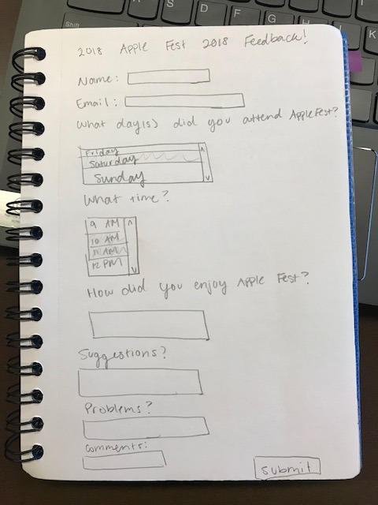
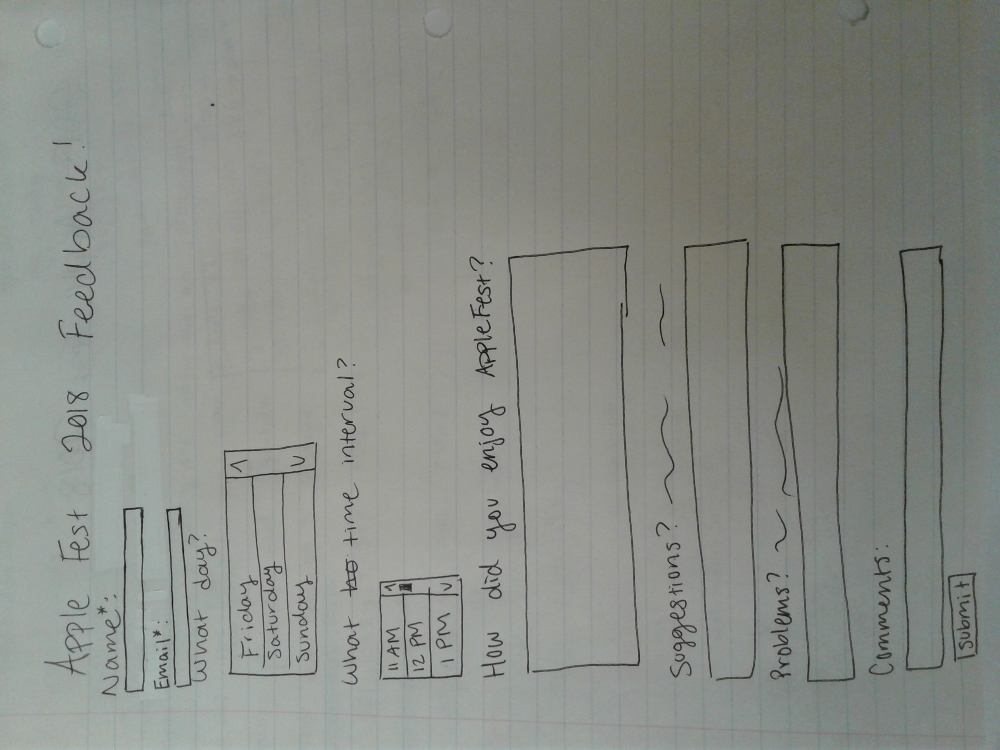
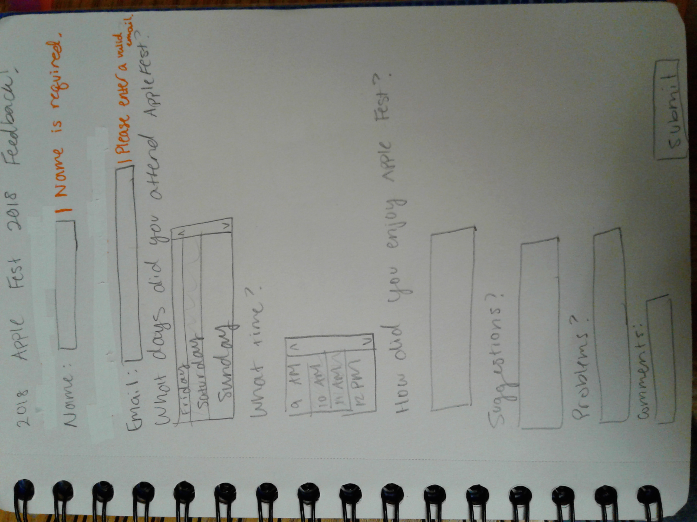
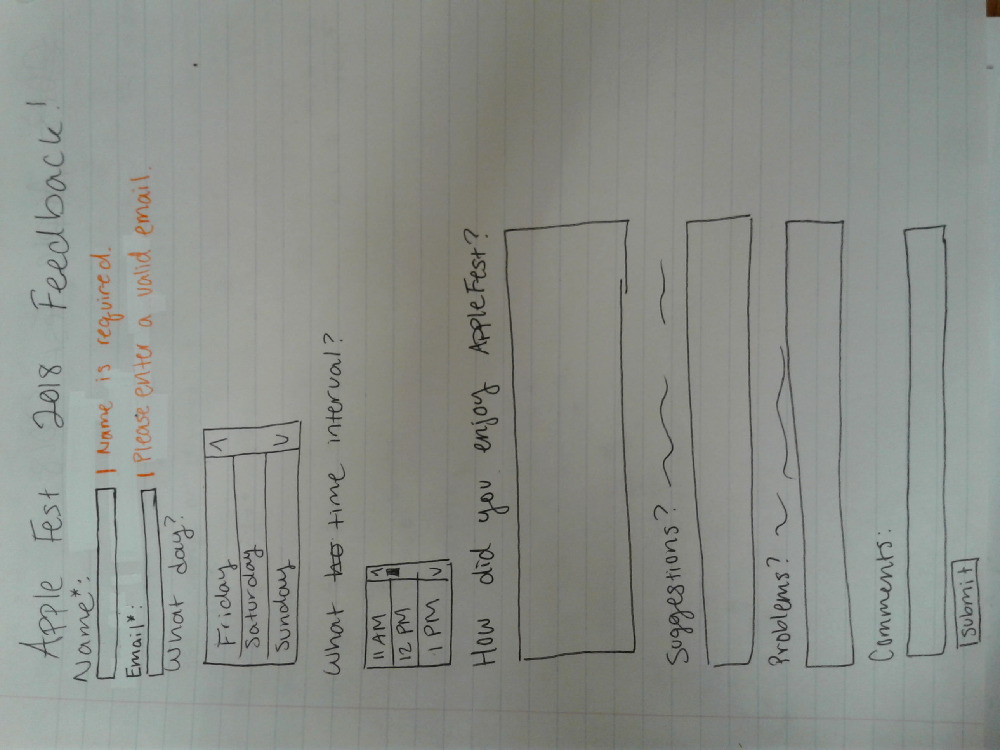
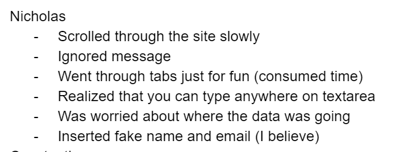
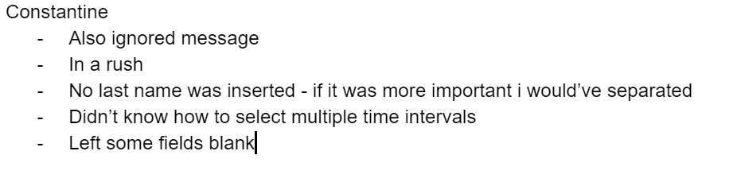

# Project 3 - Design Journey

**For each milestone, complete only the sections that are labeled with that milestone.**

Be clear and concise in your writing. Bullets points are acceptable.

## Milestone 1

## Target Audience (Milestone 1)

[Who is your site's target audience? This should be the original target audience from Project 1 or Project 2.]

My target audience is a mom that lives in Syracuse (1 hour car ride) who wants to know if it's worth coming to Ithaca specifically for Apple Fest. She is not familiar with Ithaca and has only heard about Apple Fest through word of mouth. She wants to know if the effort (especially including the drive) will be worth her family's time. She has kids in elementary school and if they are satisfied then she will also be satisfied.

## Planning & Designing User Input (Milestone 1)

[Determine what purpose the form for your site will accomplish, where it will go (physical placement on page and the HTML file name), and what form elements you plan on using.]

- My form will be a feedback form for those who would like to provide feedback after they have attended Apple Fest.
- Name, email,  what time you went, how did you enjoy it, any improvements, any problems.
- Since Apple Fest has already occurred and will not be occurring again till next year; the feedback form will be placed on the homepage so that we can get as much response as possible. There will be a small banner at the top of the page the redirects you to the bottom to give feedback.
- Form elements: text field, text area, multiple select list

[Include sketches on your form below. Include sketches of your mobile and desktop versions. Image must show in Atom's Markdown Preview, otherwise 0 points for sketch. (Remember your relative URL should be case sensitive.)]
 This design is for the desktop version of the form.
 This is the mobile version of the form.

[What submission method will your form use? GET or POST. Explain your reasoning.]
POST because it's a lot of information that shouldn't be included in the url.
Additionally, if the page were to be reloaded we don't want the form to be submitted twice or saved. That would be a hassle for the person who is sifting through the forms and that information shouldn't be saved/ copies shouldn't exist except for the examiner to see.
## Determine the Form Validation Criteria (Milestone 1)

[For each control in your form, specify the validation criteria and your reasoning behind the criteria.]

- name - text field, required
Reasoning: If we have follow-up questions on their feedback we would have a name to address them by. It's also nice to have a name for the form so that we can associate the form with the name if there would be a foreseeable need to organize them in any way.

- email - email, required
Reasoning: We want a means to contact them and email is the only form of contact we are asking for therefore it is required.

- what day you went - multiple select list, optional  
  Reasoning: to limit the choices to the days that apple fest occurred. It also must be multiple select because someone might've went for more than one day

- what time you went - multiple select list, optional
  Reasoning: Multiple select list so that the user can choose a time interval.

- how did you enjoy it - text area, optional
Reasoning: Text Area because they are going to be writing anything from one word replies to sentences or paragraphs; so we have to accommodate for the worst case scenario (paragraphs). Optional and not required because we're getting feedback - they are filling this form out willingly to help us improve Apple Fest - therefore the feedback fields are optional.

- any improvements - text area, optional
Reasoning: Text Area because they are going to be writing anything from one word replies to sentences or paragraphs; so we have to accommodate for the worst case scenario (paragraphs). Optional and not required because we're getting feedback - they are filling this form out willingly to help us improve Apple Fest - therefore the feedback fields are optional.

- any problems - text area, optional
Reasoning: Text Area because they are going to be writing anything from one word replies to sentences or paragraphs; so we have to accommodate for the worst case scenario (paragraphs). Optional and not required because we're getting feedback - they are filling this form out willingly to help us improve Apple Fest - therefore the feedback fields are optional.

- extra comments - text area, optional
Reasoning: Text Area because they are going to be writing anything from one word replies to sentences or paragraphs; so we have to accommodate for the worst case scenario (paragraphs). Optional and not required because we're getting feedback - they are filling this form out willingly to help us improve Apple Fest - therefore the feedback fields are optional.

## Design Form Feedback (Milestone 1)

[Include sketches of your mobile and desktop feedback.]
 I believe this design is suitable for the web version.
 This design is for the mobile version.

##  Plan Validation Pseudocode (Milestone 1)

[Write your form validation pseudocode here.]
If the name is valid
  Hide the userName feedback message
  Submit the form
else
  Do not submit the form
  Show the userName feedback

If the email is a valid Email
  Show no feedback message.
  Submit the form.
Otherwise,
  Do not submit the form.
  Show a feedback message to "Please enter a valid email"

## Additional Information (Milestone 1)

[(optional) Include any additional information, justifications, or comments we should be aware of.]

## Final Submission

### Task Planning (Final Submission)

[Plan out your one task for the Final Submission here before doing your user testing.]
You attended Apple Fest this past year and you are a super enthusiastic person that would like to give feedback on your experience. Give feedback using the website.

### Participant 1 (Final Submission)

1. Who is your participant, e.g., what is their name, where do they comes from, what is their job, characteristics, etc.?
Nicholas is a current sophomore at Cornell from Georgia. He majors in CS and likes music. He is very chill. He has never attended apple fest before; he has minimal interest in attending apple fest just because his friends have gone before and he likes good tasting food.

2. Does your participant belong to your target audience of the site? (Yes / No)
No
[If “No”, what’s your strategy of associating the user test results to your target audience’s needs and wants? How can your re-design choices based on the user tests make a better fit for the target audience?] For my task I gave him a hypothetical - "If he were to be someone who had attended apple fest and were to be willing to give feedback..." In any other task this might seemingly seem like this is not a sufficient user test; however, I believe this is sufficient because this just prompts him to fill out the form which is what I want him to do. Also the one thing I changed because of Nicholas's tests was that he didn't read the message. This occurred simply because of his characteristic of laziness; therefore this feedback is applicable to my target audience.

### User Testing for Participant 1 (Final Submission)
[Report the results for your user's performance on each of your tasks. You should **describe the task** you ask the user to complete, explain **what the user did**, describe the user's **reaction/feedback** to the design, **reflect on the user's performance**, determine what **re-design choices** you will make. You can also add any additional comments in the **memo** field.]

Format:
- Task #1
  - **Task Description** (What was the task for this user?)
    - You attended Apple Fest this past year and you are a super enthusiastic person that would like to give feedback on your experience. Give feedback using the website.
  - **How did the user do? Did that meet your expectation?**
    - He ignored the message on top.
    - Slowly scrolled to the bottom.
    - Asked how the information was being stored - cautious of information being taken.
    - Met my expectations
    - Did not choose a time interval
  - **User’s reaction / feedback to the design** (e.g., specific problems or issues found in the tasks)
    - you can type anywhere on the textarea - usually you can only type at the very top
  - **Your reflections about the user’s performance to the task**
    - He did as expected - although he ignored the message on the top.
  - **Re-design choices**
    - I will put a red border around the message so that it makes the message stand out.
  - **Memo** (Justify your decisions; additional notes.)
    - [You should fill this out]

[Include evidence that you conducted user testing.]
 These are some notes I took while testing Nicholas.

### Participant 2 (Final Submission)

1. Who is your participant, e.g., what is their name, where do they comes from, what is their job, characteristics, etc.?
Constantine is a current sophomore at Cornell University. He lives in New York City, but is ethnically Greece. He is also very chill and laidback like Nicholas. He has not attended Apple Fest before but he showed interest in attending because he wants good food. He is a civil engineering major so he knows how computers work and is not completely oblivious to technology.

2. Does your participant belong to your target audience of the site? (Yes / No)
No
[If “No”, what’s your strategy of associating the user test results to your target audience’s needs and wants? How can your re-design choices based on the user tests make a better fit for the target audience?] My strategy of associating results to my target audience is evaluating what characteristic influenced my user to make that decision. For this specific participant he didn't realize how to select a time interval. He is probably more prone to know about technology than a middle-aged mom. Therefore, I realized a design change needed to be made on my part.

### User Testing for Participant 2 (Final Submission)
[Report the results for your user's performance on each of your tasks. You should **describe the task** you ask the user to complete, explain **what the user did**, describe the user's **reaction/feedback** to the design, **reflect on the user's performance**, determine what **re-design choices** you will make. You can also add any additional comments in the **memo** field.]

Format:
- Task #1
  - **Task Description** (What was the task for this user?)
    - You attended Apple Fest this past year and you are a super enthusiastic person that would like to give feedback on your experience. Give feedback using the website.
  - **How did the user do? Did that meet your expectation?**
    - filled everything out quickly
    - did not meet my expectations bc he didnt know how to select a time interval
  - **User’s reaction / feedback to the design** (e.g., specific problems or issues found in the tasks)
    - Just gave up on choosing a time interval and just chose a beginning time.
  - **Your reflections about the user’s performance to the task**
    - He did pretty well overall.
    - Performed how I assume anyone who would take time out of their day to fill a feedback form would do
  - **Re-design choices**
    - Re-specified directions on the multi-select list by adding the fact that you need to press Ctrl to select multiple time intervals.
  - **Memo** (Justify your decisions; additional notes.)
    - [You should fill this out]

[Include evidence that you conducted user testing.]
 These are some notes I took while testing Constantine.

### Additional Users...

[If you conduct more user tests of your website, include your tests here. You are not *required* to conduct these additional tests, but you might find them helpful for refining your website.]

### Additional Design Justifications (Final Submission)

[If you feel like you haven’t fully explained your design choices in the final submission, or you want to explain some functions in your site (e.g., if you feel like you make a special design choice which might not meet the final requirement), you can use the additional design justifications to justify your design choices. Remember, this is place for you to justify your design choices which you haven’t covered in the design journey. Use it wisely. However, you don’t need to fill out this section if you think all design choices have been well explained in the final submission design journey.]
 The difference between the mobile and the desktop version is that on the desktop version the name and email label are right next to the text area and in the mobile version it's underneath.
