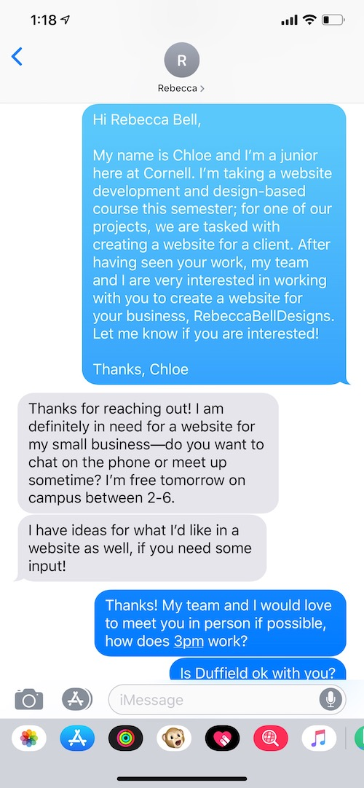
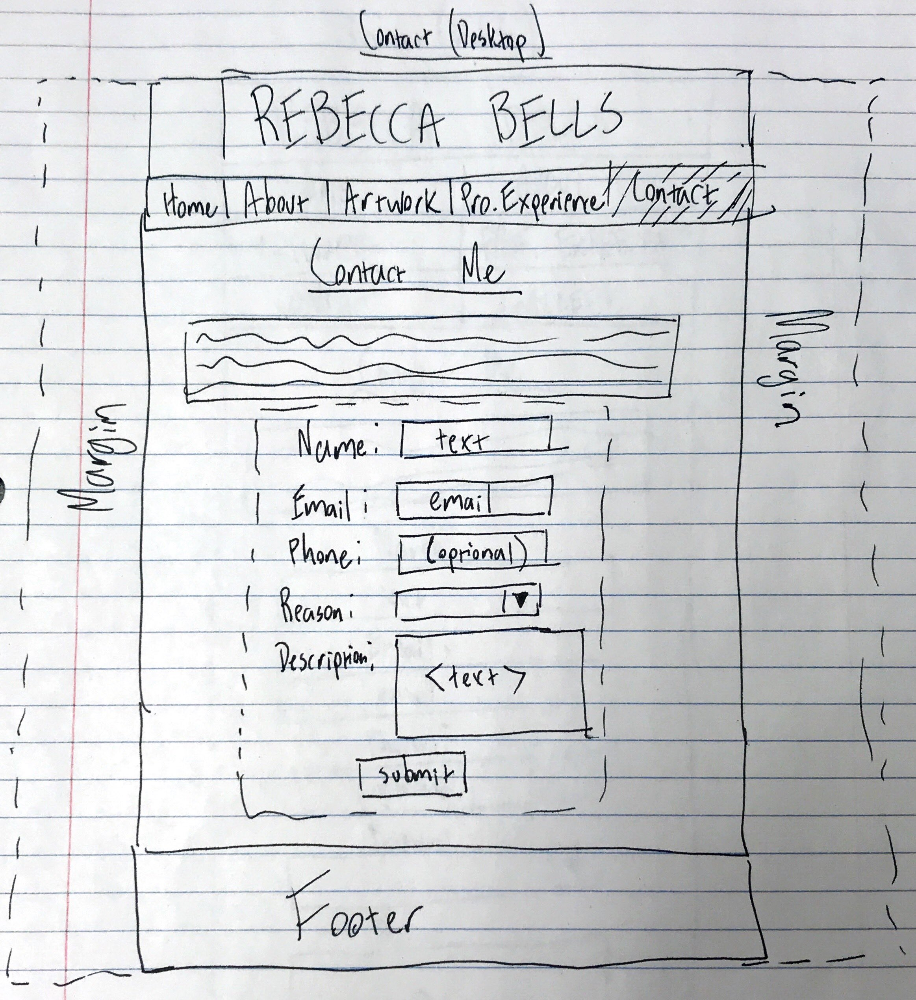

# Project 4 - Design & Plan

Your Team Name: Navy-Horse

## Milestone 1: Design your Client's Site

### Client Selection (Milestone 1)

#### Client Description

[Tell us about your client. Who is your client? What kind of website do they want? What are their key goals?]

Our client, RebeccaBellDesigns, is a small business that is owned by Cornell Engineering student, Rebecca Bell. RebeccaBellDesigns sells customized canvas paintings, aesthetic calligraphy, and various other artwork. For her business, Rebecca Bell is looking for a website that can showcase her artwork to sell to other people. The client is looking for a simple UI/color scheme, as she wants her artwork to stand out, rather than the website. The client's key goal is to have her target audience (described below) have an online gallery for viewing and possibly purchasing the pieces; we create this website to fulfill these goals.

[NOTE: If you are redesigning an existing website, give us the current URL and some screenshots of the current site. Tell us how you plan to update the site in a significant way that meets the Project 4 requirements.]


### Client Needs & Wants/Requirements (Milestone 1)

#### Purpose & Content

Our client is an artist who owns a small business, and wants a website to showcase her portfolio. She wants to attract customers or collaborators, and have them view or purchase an art piece.

#### Client Needs and Wants

[Collect your client's needs and wants for the website. Come up with several appropriate design ideas on how those needs may be met. In the **Memo** field, justify your ideas and add any additional comments you have. There is no specific number of needs required for this, but you need enough to do the job.

- Needs/Wants #1
  - **Needs and Wants** [What does your client and audience need and want?]
    - Client wants a way for the audience of her website to contact her
    - Can be potential buyers, collaborators, other professionals, etc.
  - **Design Ideas and Choices** [How will you meet those needs and wants?]
    - Create a form on the "contact" page for any visitor to contact our client with their name, email, purpose, as well as a short description of what they are hoping to achieve
  - **Memo** [Justify your decisions; additional notes.]
    - This works well because it gives our client the autonomy of whether to reply/hold a conversation or not. Also makes reaching out extremely easy for whatever reason.
    - Page with a form allows the client to gather information from collaborators (her target audience) and gives her the opportunity/means to meet or work with them.
    - Validation of user input will be important

- Needs/Wants #2
  - **Needs and Wants** [What does your client and audience need and want?]
    - Client wants audience to know the quality of artwork
  - **Design Ideas and Choices** [How will you meet those needs and wants?]
    - Customer testimonial section
  - **Memo** [Justify your decisions; additional notes.]
    - A customer testimonial section is common and widely used in many other websites that sell products. Adding a testimonial section would allow the target audience to see the quality of RebeccaBellDesigns artwork through previous customers.

- Needs/Wants #3
  - **Needs and Wants** [What does your client and audience need and want?]
    - Client wants audience to view art pieces like a gallery.
  - **Design Ideas and Choices** [How will you meet those needs and wants?]
    - Grid-like arrangement of images of client's art
    - Different sections of artwork
  - **Memo** [Justify your decisions; additional notes.]
    - Galleries normally have different sections, so organizing content like this fulfills the want of our client to make a gallery-like feature.

- Needs/Wants #4
  - **Needs and Wants** [What does your client and audience need and want?]
    - Client wants audience to learn about the artist behind the artwork
  - **Design Ideas and Choices** [How will you meet those needs and wants?]
    - About section, quotes from the artist, picture of artist
  - **Memo** [Justify your decisions; additional notes.]
    - Adding an "about me section" allows the target audience's needs to be fulfilled, as well as our clients. Since the target audiences likes visual things, adding a picture and large quote relating to an "about the artist" description fulfills target audience's needs.

#### Client Meeting Notes

[By this point, you have met once with your client to discuss all their requirements. Include your notes from the meeting, an email they sent you, or whatever you used to keep track of what was discussed at the meeting. Include these artifacts here.]

Reaching out to client:



Notes during client meeting (rough outline of things client talked about):


### Target Audience (Milestone 1)

#### Target Audience(s)

[Tell us about the specific audience(s) for this website.]

The target audience for this website are clients of RebeccaBellDesigns. More specifically, these clients are college students in sororities, females aged 12-30 years old, or "Instagrammers"/bloggers who want to draw inspiration from seeing hand-made artwork. These types of people really like making or viewing customized and unique artwork, and possibly want an art piece themselves. They belong to tightly knitted communities, and often know of each other.

#### Target Audience Needs

[What are the needs of your target audience(s)? Note that these are probably *not* the needs of your client.]

- to purchase a personalized and customized art piece
**Design Choices:** Artwork page, with large displays of art pieces and their prices

- to obtain more information about the artist, and the quality of the artwork before purchasing.
**Design Choices:** About page to learn more about Rebecca, and a testimonials page to learn more about how the artwork has been received by previous customers.

- to contact Rebecca about purchasing items and/or professional opportunities
**Design Choices:** Contact form
  - provide a method for individuals to inquire about specific needs

### Initial Design (Milestone 1)

#### Content

[Place your content in the **content** folder. NOT in the documents folder.]

[Note any content (e.g., text, image) that you need to make/get from the client here.]
- client's artwork
- information about Rebecca for the about page

#### Content Organization, Information Architecture, and Navigation

[Lay out the plan for how you'll organize the site and which content will go where. Plan out the navigation for the site. Document your process for organizing the content.]

[Note: As with the Needs and Wants table, there is no specific amount to write here. You simply need enough content to do the job.]

- **Navigation**
  - Home
    - animated gallery
  - About
    - photo of artist
    - description
  - Artwork
    - different categories sorting her art examples
  - Testimonials
    - Reviews from other customers
  - Contact
    - contact form

- **Content** (List all the content corresponding to main navigation and sub-categories.)

- Home
  - Introduction and a few photos of artwork
  - animated gallery displaying a couple of the client's artwork from each of her main categories of art (Canvas, Letters, Notebook)
- About
  - photo of artist
  - description of artist work and interests, education, general information
- Artwork
  - showcase all the artwork by the client, with a brief description for each piece. the artwork will be sorted into different categories and there will be links for the user to easily navigate to each section.
- Testimonials
  - Individual quotations (reviews) from previous customers, some reviews more highlighted (showcased) than others
- Contact
  - contact form, allowing the user to to get in contact and inquire about purchases


- **Process**
  - 
  - [explanation of how your come up with your content organization and navigation.]
  Navigation order - Home, About, Artwork, Testimonials, Contact

  Home is first because it conveys generalized information about our client that applies to the target audience.
  The About page is second because our client wants people to know the her initially. Our target audience is that they belong to tightly-knitted communities, so it is imperative that the target audience knows about Rebecca, the artist. Therefore, we place the page as higher priority on our website.
  The Artwork page is third (in the middle of our navigation as well) because it has precedence over the latter pages because one of our client's needs is to have her target audience purchase/view her art.
  The Testimonials page is fourth because it is next to the Artwork page. After the target audience of this website views an art piece and potentially wants to purchase it, they may want to read about what previous customers have said about our client's products. Therefore, it aligns closely with the Artwork page, and is hence sorted this way.
  The Contact page is last because for the same reason as the Testimonials page, the Contact page relates to the Artwork and Testimonials page closely. The idea is that the target audience visits the Artwork page first, then the testimonials page, then the contact page, which is why we sorted in this way.


#### Sketches

[Include exploratory idea sketches of your website.]


[Include sketches of your finalized design.]

**Home (Desktop)**

**Home (Mobile)**

**About**

**Professional Experience**

**Artwork (Desktop)**

**Artwork (Mobile)**

**Contact (Desktop)**

**Contact (Mobile)**


#### Interactivity

[What interactive features will your site have? Describe how the interactivity connects with the needs of the clients/target audience.]

The sites home page will display images of the artwork one by one to ensure the artwork is the focus of the page, and attract the users attention. There will also be a form which will be used to attract collaborators, buyers, and professionals to contact/inquire about purchasing her works. There will also be a gallery which will allow her audience to view all of her work and get to know her as an artist.

- Contact Page
    Form with validation for user input in javascript, conditional statements to ensure that required fields are not empty and all submitted fields are valid as per the client's needs.

- Gallery on home screen
    Interactive gallery displaying all of the clients artwork that the user can scroll through

- Artwork
    Interactive viewing of different categories of artwork. artwork of a specific category is shown when the user clicks on the category navigation title. Image classes are then shown and hidden.

#### Additional Comments (Milestone 1)

[If you feel like you haven't fully explained your design choices, or if you want to explain some other functions in your site (such as special design decisions that might not meet the Project 4 requirements), you can use this space to justify your design choices or ask other questions about the project and process.]


## Milestone 2: Draft of Coded Website

### Interactivity (Milestone 2)

[Write your interactivity pseudocode here. Remember you must use two conditional statements.]

**For the Interactive Gallery**
```
if the next button is pressed
  if the current photo is the last photo
    show the first photo
  else
    show the following photo
```

**For the contact form**
```
when the user tries to submit the form

if first name field is empty or not valid (e.g. no spaces, no numbers):
  show a feedback message to check the first name
if last name field is empty or not valid (e.g. no spaces, no numbers):
  show a feedback message to check the last name
if user email field is empty:
  show a feedback message to enter an email
if user email field is invalid:
  show a feedback message to enter a valid email
if phone number is entered
  if phone number is invalid
    show feedback message to check the phone number
[Reason field is from drop down, so no need for validation]
if description field is empty:
  show feedback message to enter a description
if no errors after checking each field:
  submit the form
  ...ONLY case where the form is submitted is here, in any other case where feedback is showed, it resets and the form is not sent to the server.
```
Example:
```
if today is a monday:
  show Monday's soup and the daily special

```

**For the Artwork Page**
```
if the "Paintings" link is pressed
  change color of "paintings" button
  change colors of other buttons to default
  unhide paintings class
  hide all other image classes
else if the "For Sale" link is pressed
  change color of "For Sale" button
  change colors of other buttons to default
  unhide For sale class
  hide all other image classes
else if the "drawings" link is pressed
  change color of "drawings" button
  change colors of other buttons to default
  unhide drawings class
  hide all other image classes
else
  Do nothing, keep current hidden/unhidden status of classes

```
NOTE
```
  Class names/categories are subject to change based on images and content provided by the client.
```

### Tasks (Milestone 2)

[You will need to come up with at least 4 tasks. List your tasks here. You *do not* have to do user tests yet.]

Task 1: Submit a request to buy the piece of artwork named "I love you" with the email "letmebuypls@buyer123.com".

Task 2: Find out how much a canvas painting costs.

Task 3: Look for what previous customers have said about RebeccaBellDesigns.

Task 4: Find out whether Rebecca still goes to school, and if so, where.

### Client Meeting (Milestone 2)

[By this point, you have met once with your client a second time to discuss your initial design. Include your notes from the meeting, an email they sent you, or whatever you used to keep track of what was discussed at the meeting. Write a few sentences about the design feedback you received from your client.]


### Additional Comments (Milestone 2)

[If you feel like you haven't fully explained your design choices, or if you want to explain some other functions in your site (such as special design decisions that might not meet the Project 4 requirements), you can use this space to justify your design choices or ask other questions about the project and process.]

After meeting with our client, we are possibly redefining one of the pages to better fit her needs in her website. The client needs her website to be customer oriented, so the "Professional Experience" page might change to "Customer Testimonials."

## Milestone 3: Presentation & Demo Ready Draft

### Additional Comments (Milestone 3)

[If you feel like you haven't fully explained your design choices, or if you want to explain some other functions in your site (such as special design decisions that might not meet the Project 4 requirements), you can use this space to justify your design choices or ask other questions about the project and process.]

We had changed our "Professional Experience" page to "Customer Testimonials." Our reasoning for this is mainly because our client had requested it, but also because changing this page would more closely fit they needs of our target audience.

## Final Submission: Complete, Polished, and User Tested Website

### Changes Based on Presentation (Final Submission)

[What changes did you make to your plan or design based on your peers' feedback?]
After user testing and presenting our website during lab time, we made several changes to our website. Firstly, we made the text larger. Smaller text is unaesthetic and unpleasing to read. We additionally added information about our client to the home page, because our feedback said that from looking at our home page, it was unclear what the website was about. Lastly, our final biggest change was reformatting our images on our artwork page because they were not centered, which caused many "eye-sores."

### User Testing (Final Submission)

#### Participant 1

1. Who is your participant, e.g., what is their name, where do they comes from, what is their job, characteristics, etc.?

Our first participant is Emma, who is a student at Cornell. She originally comes from Menlo, California, and studies Computer Science. She also has a chair position in the sorority Alpha Epsilon Phi, and says that one of her passions is doing make up. She even wakes up a half hour early every morning because she enjoys doing her make up so much. Her house and room is decorated with aesthetic posters, tapestries, and more art.

2. Does your participant belong to your target audience of the site? (Yes / No)
Yes.
[If “No”, what’s your strategy of associating the user test results to your target audience’s needs and wants? How can your re-design choices based on the user tests make a better fit for the target audience?]

[Report the results for your user's performance on each of your tasks. You should **describe the task** you ask the user to complete, explain **what the user did**, describe the user's **reaction/feedback** to the design, **reflect on the user's performance**, determine what **re-design choices** you will make. You can also add any additional comments in the **memo** field.]

Format:
- Task #1
  - **Task Description** (What was the task for this user?)
    - Submit a request to buy the piece of artwork named "I love you" with the email "letmebuypls@buyer123.com".
  - **How did the user do? Did that meet your expectation?**
    - navigated to correct page
    - user put first name in section, last name in corresponding section, didn't add phone, used purchased option, added "i love you message"
    - Pressed submit button
  - **User’s reaction / feedback to the design** (e.g., specific problems or issues found in the tasks)
    - Found no issues in finding the correct page
    - Form feedback returned error message
    - Found relatively no issues, but said error message for form was small
  - **Your reflections about the user’s performance to the task**
    - User completed task as expected and website interacted as expected.
  - **Re-design choices**
    - None major, make error message larger and red
  - **Memo** (Justify your decisions; additional notes.)
    - Make the text larger so that it is easier for the user to see what criteria they have to complete.

- Task #2
  - **Task Description** (What was the task for this user?)
    - Find out how much a canvas painting costs.
  - **How did the user do? Did that meet your expectation?**
    - Navigated to artwork page
    - Clicked "canvas paintings"
    - Hovered over various canvas paintings on website
    - Found price and answered Tasks
  - **User’s reaction / feedback to the design** (e.g., specific problems or issues found in the tasks)
    - No major problems, user completed task as expected
  - **Your reflections about the user’s performance to the task**
    - User believes the art needs to be reformmated so that the artwork isn't unevenly distributed on the page
  - **Re-design choices**
    - Re-align images
  - **Memo** (Justify your decisions; additional notes.)
    - Re-align images so that they are easy for the user to view, this helps the target audience because artwork displayed in a real gallery isn't scattered or disorganized.

- Task #3
  - **Task Description** (What was the task for this user?)
    - Look for what previous customers have said about RebeccaBellDesigns.
  - **How did the user do? Did that meet your expectation?**
    - Navigated to Testimonials
    - Read all testimonials under "what customers are saying..." heading
  - **User’s reaction / feedback to the design** (e.g., specific problems or issues found in the tasks)
    - Likes reviews that are on
    - Maybe a searching feature to filter reviews
  - **Your reflections about the user’s performance to the task**
    - Completed task as expected and navigated exactly how we expected
  - **Re-design choices**
    - Perhaps add a searching feature for reviews
  - **Memo** (Justify your decisions; additional notes.)
    - Adding a searching feature for reviews adds to the UX because it allows users to search for a specific aspect of our client, and not just have to read through all the reviews to find something they are looking for.

- Task #4
  - **Task Description** (What was the task for this user?)
    - Find out whether Rebecca still goes to school, and if so, where.
  - **How did the user do? Did that meet your expectation?**
    - Navigated to correct page, read about Rebecca, found that she was going to Cornell.
  - **User’s reaction / feedback to the design** (e.g., specific problems or issues found in the tasks)
    - Thought that picture should be bigger on about page
  - **Your reflections about the user’s performance to the task**
    - User completed task but had comments about the page itself, which was helpful in adding design fixes to the page.
  - **Re-design choices**
    - Make image of artist larger
  - **Memo** (Justify your decisions; additional notes.)
    - Image is easier to see, will line up with quote, easy for users to get to know the artist and become more personal with her


[Include evidence of your user testing process.]


#### Participant 2

1. Who is your participant, e.g., what is their name, where do they comes from, what is their job, characteristics, etc.?

Our second participant is Alex, a cadet at the U.S. Air Force Academy. She is 18 years old, comes from San Diego, CA, and is a full-time student. Because she "doesn't get a lot of freedom picking my own clothes in the military," Alex is really into fashion, design, and creative clothing. She likes spending her (limited) free time going to the mall with her friends from high school, browsing magazines, and Snapchatting.

2. Does your participant belong to your target audience of the site? (Yes / No)

[If “No”, what’s your strategy of associating the user test results to your target audience’s needs and wants? How can your re-design choices based on the user tests make a better fit for the target audience?]

Format:
- Task #1
  - **Task Description** (What was the task for this user?)
    - Submit a request to buy the piece of artwork named "I love you" with the email "letmebuypls@buyer123.com".
  - **How did the user do? Did that meet your expectation?**
    - Went to artwork page instantly
    - Looked around at options and clicked around until found the piece
    - Saw price and tried to click the photo, but nothing happened
    - Went to contact page next
    - Read description and saw "purchase" option
    - Filled out form with email and no phone number, short description that wanted to purchase the piece
  - **User’s reaction / feedback to the design** (e.g., specific problems or issues found in the tasks)
    - Assumed that she had to find the piece of artwork on the artwork page, and didn't want to keep looking through them until she found it
    - Realistically, name could have been anything and not even listed in the artwork page, contact page was the only one needed
    - Task was pretty easy once she realized cant click and purchase on the artwork page
  - **Your reflections about the user’s performance to the task**
    - - The trouble with this task didn't stem from the task itself, but rather the wording of it
    - Should mention to the next participant that they don't have to find the piece of artwork, as in a real scenario a user would be browsing, see something they like, and then attempt to purchase it already knowing where it is located as well as the name
  - **Re-design choices**
    - Including a blurb mentioning that artwork can be purchased through the contact page
  - **Memo** (Justify your decisions; additional notes.)
    - - Now, when users want to purchase a piece of artwork that they really like, they wont get frustrated clicking on the piece on the 'artwork' page, and will rather navigate to the contact page and fill out the form easily

- Task #2
  - **Task Description** (What was the task for this user?)
    - Find out how much a canvas painting costs.
  - **How did the user do? Did that meet your expectation?**
    - User already saw the artwork page from the previous step
    - Went straight to the artwork page and clicked "canvas paintings"
    - Moused over each painting to see how much each of the paintings costed
  - **User’s reaction / feedback to the design** (e.g., specific problems or issues found in the tasks)
    - Said it was really nice to be able to sort by type (e.g. canvas painting) so that she didn't have to pick and choose, was able to see all of the prices of the canvas paintings quickly
  - **Your reflections about the user’s performance to the task**
    - Exactly as expected, was worried that user wouldn't see one priced more than others, but scrolled through each one
  - **Re-design choices**
    - Thought of including a list of prices, but each price is different and they vary by artwork
  - **Memo** (Justify your decisions; additional notes.)
    - n/a

- Task #3
  - **Task Description** (What was the task for this user?)
    - Look for what previous customers have said about RebeccaBellDesigns.
  - **How did the user do? Did that meet your expectation?**
    - User navigated to 'testimonials' page
    - Read quotes from other customers
  - **User’s reaction / feedback to the design** (e.g., specific problems or issues found in the tasks)
    - User thought the task was too easy
    - Said to include more testimonials and ability to scroll through them
  - **Your reflections about the user’s performance to the task**
    - Happy with how quickly and easily user was able to complete tasks
  - **Re-design choices**
    - n/a
    - potentially add more testimonials if the client actually has any
  - **Memo** (Justify your decisions; additional notes.)
    - User completed task ideally and had no complaints

- Task #4
  - **Task Description** (What was the task for this user?)
    - Find out whether Rebecca still goes to school, and if so, where.
  - **How did the user do? Did that meet your expectation?**
    - User navigated to about page without hesitation
    - Read description under the head shot
    - Saw that third year student at Cornell
  - **User’s reaction / feedback to the design** (e.g., specific problems or issues found in the tasks)
    - Said was really easy to find all the information needed
  - **Your reflections about the user’s performance to the task**
    - Happy with how self-explanatory and easy to complete the task was
  - **Re-design choices**
    - Maybe include even more information about Rebecca, as this is something that people will likely be interested in and the information is very easily accessible
  - **Memo** (Justify your decisions; additional notes.)
    - Balance of information and minimalistic design

[Include evidence of your user testing process.]


#### Participant 3

1. Who is your participant, e.g., what is their name, where do they comes from, what is their job, characteristics, etc.?

Our third participant is Brynne, a student at Cornell studying Computer Science. She works at the software company Palantir, and likes reading in her spare time. Brynne also draws herself--her artwork is cartoon drawings for her local newspaper in her hometown. She says that she really respects artists and likes being in a community of creative and innovative people.

2. Does your participant belong to your target audience of the site? (Yes / No)
Yes.
[If “No”, what’s your strategy of associating the user test results to your target audience’s needs and wants? How can your re-design choices based on the user tests make a better fit for the target audience?]

Format:
- Task #1
  - **Task Description** (What was the task for this user?)
    - Submit a request to buy the piece of artwork named "I love you" with the email "letmebuypls@buyer123.com".
  - **How did the user do? Did that meet your expectation?**
   - User navigated to the artwork page instantly
   - Saw the blurb about purchasing on the contact page
   - Didn't even bother looking through the art pieces, went straight to contact page
   - Filled out name, email, and name of piece in description to purchase
  - **User’s reaction / feedback to the design** (e.g., specific problems or issues found in the tasks)
    - Mentioned that a 'checkout' option like on a shopping site would be really cool
    - However, was very self-explanatory and easy to complete the task because was able to see the blurb
  - **Your reflections about the user’s performance to the task**
    - Happy that with the newly included blurb, users are able to navigate to the contact page quickly without getting frustrated with not being able to click the artwork
  - **Re-design choices**
    - n/a
  - **Memo** (Justify your decisions; additional notes.)
    - Task was performed exactly as desired after changes from the last test

- Task #2
  - **Task Description** (What was the task for this user?)
    - Find out how much a canvas painting costs.
  - **How did the user do? Did that meet your expectation?**
    - User asked if they should submit a form on the contact page again
    - Navigated to artwork page
    - Selected canvas painting option
    - Scrolled over first two, saw was the same price, and completed task
  - **User’s reaction / feedback to the design** (e.g., specific problems or issues found in the tasks)
    - Last page user was on was the contact page, so they assumed that the tasks went hand in hand and was testing form submission, if they knew the information was somewhere on the website, they would have done it differently
  - **Your reflections about the user’s performance to the task**
    - Happy with performance aside from initial task confusion
    - Worried that people might see the first price and think they all are the same price
  - **Re-design choices**
    - Ask client if we should include a "prices may vary" blurb
  - **Memo** (Justify your decisions; additional notes.)
    - We dont want people browsing to see one price, assume all paintings are the same price, and request to purchase a painting with the wrong price in mind

- Task #3
  - **Task Description** (What was the task for this user?)
    - Look for what previous customers have said about RebeccaBellDesigns.
  - **How did the user do? Did that meet your expectation?**
    - User clicked Testimonials
    - Read quotes very easily
  - **User’s reaction / feedback to the design** (e.g., specific problems or issues found in the tasks)
    - Minimalistic design helped a lot not only finding the page but also reading the quotes because they stood out
  - **Your reflections about the user’s performance to the task**
    - Really happy with structure of page as well as design
  - **Re-design choices**
    - n/a
  - **Memo** (Justify your decisions; additional notes.)
    - Potentially add more quotes if they exist, as mentioned in the earlier user test

- Task #4
  - **Task Description** (What was the task for this user?)
    - Find out whether Rebecca still goes to school, and if so, where.
  - **How did the user do? Did that meet your expectation?**
    - User navigated to about page
    - Read the blurb at the bottom and found all the information required]
  - **User’s reaction / feedback to the design** (e.g., specific problems or issues found in the tasks)
    - User said it was really easy to know what to do because it was the only page she hasn't visited yet
  - **Your reflections about the user’s performance to the task**
    - Happy with the performance, as this is something that will likely happen often
  - **Re-design choices**
    - n/a
  - **Memo** (Justify your decisions; additional notes.)
    - About page information is mostly dictated by our client and how much information she wants to share

[Include evidence of your user testing process.]


### Changes Based on User Testing (Final Submission)

[What changes did you make to your plan or design based on user testing?]
- Images on Home page
- Blurb on artwork page that users can purchase artwork on the "contact" page
- Styling
- Larger text on contact page
- Larger image of client on about page

### Final Notes to the Clients (Final Submission)

[Describe in some detail what the client will do (or would have to do) in order to make this website go live. What is the deployment plan?]
The client will find a web host provider, upload their website to the web host provider, then register for a domain name. One website that they can use as a web host provider is namecheap.com/hosting.
[Include any other information that your client needs to know about your final website design. For example, what client wants or needs were unable to be realized in your final product? Why were you unable to meet those wants/needs?]
Text to client:

"Hi Rebecca, We really appreciate you taking the time to help us with our project and we enjoyed building a website to fit your clients' needs! We can change the slideshow on the front to automatically transition rather than having the user click through to transition if you'd like (with more time). We should definitely keep in contact and can assist with any web development and design needs you may have."

### Final Notes to the Graders (Final Submission)

[1. Give us three specific strengths of your site that sets it apart from the previous website of the client (if applicable) and/or from other websites. Think of this as your chance to argue for the things you did really well.]

- While subtle, our website has a unique design. The background of the website is slightly textured to mimic the look of a piece of paper. This choice of design serves multiple purposes. For one, it adds to the "minimalistic" overall design that the client requested, and doesn't distract the user from the artwork itself. Secondly, the paper background is art itself-- the client wants to highlight the fact she is an artist, so this paper background gives the website the look of a "drawing" or "sketch." Overall, we believe this is a unique and beautiful touch.
- We added interactivity on the home page. We essentially made a gallery of the client's products that users can click through to view different images. By immediately giving the user ability to interact with on the home page, we are giving the user ability to interact with our client's art, and almost mimics the act of flipping through a magazine, or flipping through a book of artwork. We believe this feature adds to the UX by giving providing an something interactive and meaningful.
- Our nav bar is fixed when the user scrolls down the screen. We did this, because the current page on our nav bar is underlined (so that the user knows what page they are on), so the nav bar additionally acts like a heading and allows the user to really know what page they are on. Furthermore, having this fixed nav bar allows users to easily navigate between pages, which is what they will be doing if they are purchasing an art piece. To conclude, although this was a simple addition, we put a lot of thought and reasoning behind adding this feature and believes it adds to the usability for the target audience of the website.

[2. Tell us about things that don't work, what you wanted to implement, or what you would do if you keep working with the client in the future. Give justifications.]

While we generally implemented everything we and the client had desired, and everything that fit the needs of the target audience, we would have liked to integrate some more features into this website. For example, we would have liked to make our gallery slideshow on the front page automatically play on a timer, rather than having the user click through using the "Next" button. This would improve the usability of the website because the user would not have to click through each image to view it.

[3. Tell us anything else you need us to know for when we're looking at the project.]
